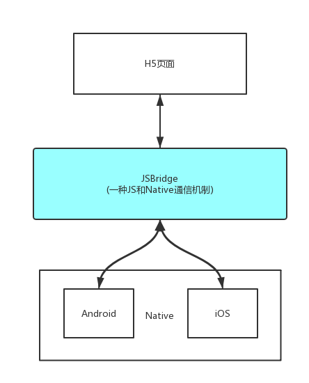
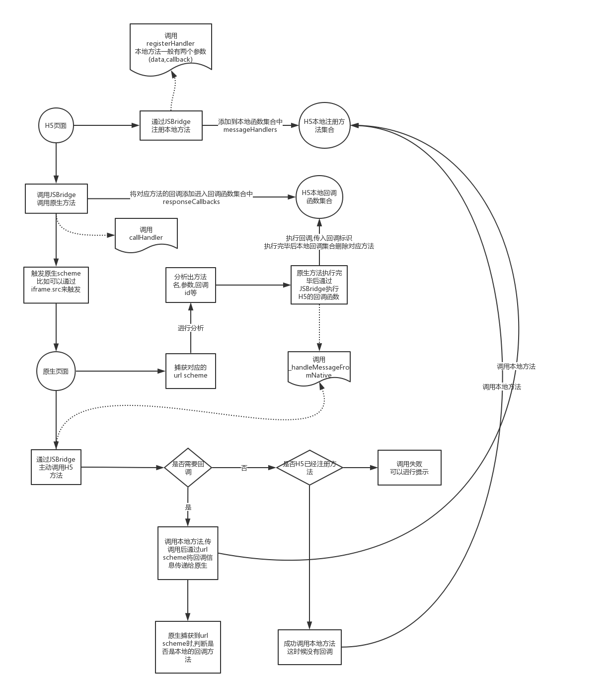
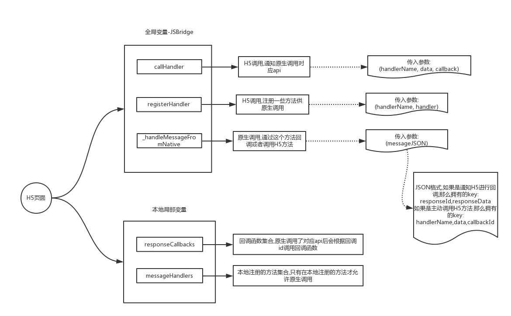

## 现有APP分析

现在App开发，除了Hybrid，还有Native，纯web，React Native等方案。

- Native APP：

  即传统的原生APP开发模式，Android基于Java语言，底层调用Google的 API;iOS基于OC或者Swift语言，底层调用App官方提供的API，体验最好。

- web APP

  即移动端的网站，将页面部署在服务器上，然后用户使用各大浏览器访问。一般泛指 SPA(Single Page Application)模式开发出的网站，体验最差。

- Hybrid APP

  即混合APP开发，由Native通过JSBridge等方法提供统一的API，然后用Html5+JS来写实际的逻辑，调用API。这种模式下，由于Android，iOS的API一般有一致性，而且最终的页面也是在webview中显示，所有有跨平台效果。

- React Native APP（weex）

  Facebook发起的开源的一套新的APP开发方案，使用JS+部分原生语法来实现功能。初次学习成本较高，但是在入门后，经过良好的封装也能够实现大部分的跨平台。而且体验很好。

|                      | Native App                   | Web App                       | Hybrid App                   | React Native App           |
| -------------------- | ---------------------------- | ----------------------------- | ---------------------------- | -------------------------- |
| 原生功能体验         | 优秀                         | 差                            | 良好                         | 接近优秀                   |
| 渲染性能             | 非常快                       | 慢                            | 接近快                       | 快                         |
| 是否支持设备底层访问 | 支持                         | 不支持                        | 支持                         | 支持                       |
| 网络要求             | 支持离线                     | 依赖网络                      | 支持离线(资源存本地情况)     | 支持离线                   |
| 更新复杂度           | 高(几乎总是通过应用商店更新) | 低(服务器端直接更新)          | 较低(可以进行资源包更新)     | 较低(可以进行资源包更新)   |
| 编程语言             | Android(Java)，iOS(OC/Swift)  | js+html+css3                  | js+html+css3                 | 主要使用JS编写，语法规则JSX |
| 社区资源             | 丰富(Android，iOS单独学习)    | 丰富(大量前端资源)            | 有局限(不同的Hybrid相互独立) | 丰富(统一的活跃社区)       |
| 上手难度             | 难(不同平台需要单独学习)     | 简单(写一次，支持不同平台访问) | 简单(写一次，运行任何平台)    | 中等(学习一次，写任何平台)  |
| 开发周期             | 长                           | 短                            | 较短                         | 中等                       |
| 开发成本             | 昂贵                         | 便宜                          | 较为便宜                     | 中等                       |
| 跨平台               | 不跨平台                     | 所有H5浏览器                  | Android，iOS，h5浏览器         | Android，iOS                |
| APP发布              | App Store                    | Web服务器                     | App Store                    | App Store                  |

React Native 使用js，**反H5方案**

小程序 使用js，**反H5方案**

轻应用 使用js，**反H5方案**


## Hybrid APP 发展

**原生** =>  **H5**	  => **Hybrid APP**  (多View混合，单View混合，Web主体型，多主体共存型)


## **Hybrid APP** 分类

- 多View混合

  将webview作为Native中的一个view组件，当需要的时候在独立运行显示，也就是说主体是Native，web技术只是起来一些补充作用。

- 单View混合

  同一个view内，同时包括Native view和webview(互相之间是层叠的关系）

- **Web主体型**

  只会使用H5和js来编写，然后js可以调用原生提供的api来实现一些拓展功能(比如PhoneGap，AppCan，Html5+等)，但是由于一些webview自身的限制，导致了这种模式在性能上损耗不小，包括在一些内存控制上的不足，所以导致体验要逊色于原生不少。

- **多主体共存型**

  原生开发和h5开发共存，也就是说，对于一些性能要求很高的页面模块，用原生来完成，对于一些通用型模块，用h5和js来完成。


## Hybrid APP 架构

Hybrid APP架构是通过JSBridge，H5页面可以调用Native的api，Native也可以调用H5页面的方法或者通知H5页面回调。



### 交互方式

原生和前端交互常用有下面两种方式：`url scheme`（适用于所有版本设备）和`javascriptCore`（在Android中是`addJavascriptInterface`，不适用于老版本系统）。

#### URL scheme 

一般情况下，url scheme是一种类似于url的链接，由前端页面通过定义的`JSBridge`中某种方式触发scheme(如用iframe.src)。然后系统会进行判断，如果是系统的url scheme，则打开系统应用。否则找看是否有app注册这种scheme，打开对应app。然后Native捕获对应的url触发事件，然后拿到当前的触发url，根据定义好的协议分析当前触发了哪种方法，然后通过定义的`JSBridge`中某个方法来执行回调等。

要注意的是，这种scheme必须原生app注册后才会生效，如微信的scheme为(weixin://)


#### Api 直接交互

分别包括Android，iOS中H5和原生互相调用，总结如下：

- H5调Android-原生通过`addJavascriptInterface`注册，然后H5直接调用
- Android调H5-原生通过`loadUrl`来调用H5，`4.4`及以上还可以通过`evaluateJavascript`调用
- H5调iOS-原生通过`JavaScriptCore`注册（需`ios7`以上），然后H5直接调用
- iOS调H5-通过`stringByEvaluatingJavaScriptFromString`


### JSBridge原理

接下来我们简单讲解一下常用的`URL scheme`交互方式中核心`JSBridge`的实现。

#### 实现思路

要实现JSBridge，我们可以进行关键步骤分析

- **第一步: 设计出一个Native与JS交互的全局桥对象**
- **第二步: JS如何调用Native**
- **第三步: Native如何得知api被调用**
- **第四步: 分析url-参数和回调的格式**
- **第五步: Native如何调用JS**
- **第六步: H5中api方法的注册以及格式**




#### 第一步，全局桥

第一步设计出一个Native与JS交互的全局桥对象，JS和Native之间的通信必须通过一个H5全局对象JSbridge来实现，该对象有如下特点:

- **该对象名为"JSBridge"，是H5页面中全局对象window的一个属性**

- **该对象有如下方法**

  - `registerHandler( String，Function )`：H5调用注册本地JS方法，注册后Native可通过JSBridge调用。调用后会将方法注册到本地变量`messageHandlers` 中
  - `callHandler( String，JSON，Function )`：H5调用调用原生开放的api，调用后实际上还是本地通过url scheme触发。调用时会将回调id存放到本地变量`responseCallbacks`中
  - `_handleMessageFromNative( JSON )`：Native调用H5页面注册的方法，或者通知H5页面执行回调方法。

  


#### 第二步，JS调用Native

在第一步中，我们定义好了全局桥对象，可以我们是通过它的callHandler方法来调用原生的，那么它内部经历了一个怎么样的过程呢？如下

- **(1) 判断是否有回调函数，如果有生成一个回调函数id，并将id和对应回调添加进入回调函数集合`responseCallbacks`中**

- **(2) 通过特定的参数转换方法，将传入的数据、方法名拼接成一个url scheme**

  ```js
  //url scheme的格式如
  //基本有用信息就是后面的callbackId，handlerName与data
  //原生捕获到这个scheme后会进行分析
  var uri = CUSTOM_PROTOCOL_SCHEME: + '//API_Name:callbackId/handlerName?data'
  ```

- **(3) 使用内部早就创建好的一个隐藏iframe来触发scheme** 

  ```js
  //创建隐藏iframe过程
  var messagingIframe = document.createElement('iframe');
  messagingIframe.style.display = 'none';
  document.documentElement.appendChild(messagingIframe);

  //触发scheme
  messagingIframe.src = uri;
  ```


> 注意，正常来说是可以通过window.location.href达到发起网络请求的效果的，但是有一个很严重的问题，就是如果我们连续多次修改window.location.href的值，在Native层只能接收到最后一次请求，前面的请求都会被忽略掉。所以JS端发起网络请求的时候，需要使用iframe，这样就可以避免这个问题。


#### 第三步，Native捕获调用

在上一步中，我们已经成功在H5页面中触发scheme，那么Native如何捕获scheme被触发呢？根据系统不同，Android和iOS分别有自己的处理方式：

- Android捕获url scheme

  在Android中(WebViewClient里)，通过`shouldoverrideurlloading`可以捕获到url scheme的触发。另外，Android中也可以不通过iframe.src来触发scheme，android中可以通过`window.prompt(uri， "");`来触发scheme，然后Native中通过重写WebViewClient的`onJsPrompt`来获取uri。

- iOS捕获url scheme

  iOS中，UIWebView有个特性：在UIWebView内发起的所有网络请求，都可以通过delegate函数在Native层得到通知。这样，我们可以在webview中捕获url scheme的触发(原理是利用 shouldStartLoadWithRequest)


之后Native捕获到了JS调用的url scheme，接下来就该到下一步分析url了。


#### 第四步，分析url和回调

在前面的步骤中，Native已经接收到了JS调用的方法，那么接下来，原生就应该按照定义好的数据格式来解析数据了

[url scheme的格式 ](http://www.cnblogs.com/dailc/p/5931324.html#urlscheme-format)前面已经提到。Native接收到Url后，可以按照这种格式将回调参数id、api名、参数提取出来，然后按如下步骤进行

- **(1) 根据api名，在本地找寻对应的api方法，并且记录该方法执行完后的回调函数id**

- **(2) 根据提取出来的参数，根据定义好的参数进行转化**

  如果是JSON格式需要手动转换，如果是String格式直接可以使用

- **(3) 原生本地执行对应的api功能方法**

- **(4) 功能执行完毕后，找到这次api调用对应的回调函数id，然后连同需要传递的参数信息，组装成一个JSON格式的参数**

  回调的JSON格式为:`{responseId:回调id，responseData:回调数据}`

  - responseId String型 H5页面中对应需要执行的回调函数的id，在H5中生成url scheme时就已经产生
  - responseData JSON型 Native需要传递给H5的回调数据，是一个JSON格式: `{code:(整型，调用是否成功，1成功，0失败)，result:具体需要传递的结果信息，可以为任意类型，msg:一些其它信息，如调用错误时的错误信息}`

- **(5) 通过JSBridge通知H5页面回调**


#### 第五步，Native调用JS

到了这一步，就该Native通过JSBridge调用H5的JS方法或者通知H5进行回调了，具体如下

```js
//将回调信息传给H5
JSBridge._handleMessageFromNative(messageJSON);	
```

**Native通知H5页面进行回调**

数据格式为: Native通知H5回调的JSON格式

**Native主动调用H5方法**

Native主动调用H5方法时，数据格式是:`{handlerName:api名,data:数据,callbackId:回调id}`

- handlerName String型 需要调用的，h5中开放的api的名称
- data JSON型 需要传递的数据，固定为JSON格式(因为我们固定H5中注册的方法接收的第一个参数必须是JSON，第二个是回调函数)
- callbackId String型 原生生成的回调函数id，h5执行完毕后通过url scheme通知原生api成功执行，并传递参数

注意，这一步中，如果Native调用的api是h5没有注册的，h5页面上会有对应的错误提示。

另外，H5调用Native时，Native处理完毕后一定要及时通知H5进行回调，要不然这个回调函数不会自动销毁，多了后会引发内存泄漏。


#### 第六步，H5中api注册

前面有提到Native主动调用H5中注册的api方法，那么h5中怎么注册供原生调用的api方法呢？格式又是什么呢？

**H5中注册供原生调用的API**

```js
//注册一个测试函数
JSBridge.registerHandler('testH5Func',function(data,callback){
	alert('测试函数接收到数据:'+JSON.stringify(data));
	callback&&callback('测试回传数据...');
});
```

如上述代码为注册一个供原生调用的api。

**H5中注册的API格式注意**

如上代码，注册的api参数是`(data,callback)`

其中第一个data即原生传过来的数据，第二个callback是内部封装过一次的，执行callback后会触发url scheme，通知原生获取回调信息。

#### 其他，不用url scheme

前面提到的JSBridge都是基于url scheme的，但其实如果不考虑Android4.2以下，iOS7以下，其实也可以用另一套方案的，如下

- **Native调用JS的方法不变**

- **JS调用Native是不再通过触发url scheme，而是采用自带的交互**

  Android中，原生通过`addJavascriptInterface`开放一个统一的api给JS调用，然后将触发`url scheme`步骤变为调用这个api，其余步骤不变(相当于以前是url接收参数，现在变为api函数接收参数)

  iOS中，原生通过`JavaScriptCore`里面的方法来注册一个统一api，其余和Android中一样(这里就不需要主动获取参数了，因为参数可以直接由这个函数统一接收)


#### 基础版JSBridge代码

这里只介绍JS的实现，具体Android，iOS实现请参考完整版本。实现如下：

```js
(function() {
	(function() {
		var hasOwnProperty = Object.prototype.hasOwnProperty;
		var JSBridge = window.JSBridge || (window.JSBridge = {});
		//jsbridge协议定义的名称
		var CUSTOM_PROTOCOL_SCHEME = 'CustomJSBridge';
		//最外层的api名称
		var API_Name = 'namespace_bridge';
		//进行url scheme传值的iframe
		var messagingIframe = document.createElement('iframe');
		messagingIframe.style.display = 'none';
		messagingIframe.src = CUSTOM_PROTOCOL_SCHEME + '://' + API_Name;
		document.documentElement.appendChild(messagingIframe);

		//定义的回调函数集合,在原生调用完对应的方法后,会执行对应的回调函数id
		var responseCallbacks = {};
		//唯一id,用来确保每一个回调函数的唯一性
		var uniqueId = 1;
		//本地注册的方法集合,原生只能调用本地注册的方法,否则会提示错误
		var messageHandlers = {};

		//实际暴露给原生调用的对象
		var Inner = {
			/**
			 * @description 注册本地JS方法通过JSBridge给原生调用
			 * 我们规定,原生必须通过JSBridge来调用H5的方法
			 * 注意,这里一般对本地函数有一些要求,要求第一个参数是data,第二个参数是callback
			 * @param {String} handlerName 方法名
			 * @param {Function} handler 对应的方法
			 */
			registerHandler: function(handlerName, handler) {
				messageHandlers[handlerName] = handler;
			},
			/**
			 * @description 调用原生开放的方法
			 * @param {String} handlerName 方法名
			 * @param {JSON} data 参数
			 * @param {Function} callback 回调函数
			 */
			callHandler: function(handlerName, data, callback) {
				//如果没有 data
				if(arguments.length == 3 && typeof data == 'function') {
					callback = data;
					data = null;
				}
				_doSend({
					handlerName: handlerName,
					data: data
				}, callback);
			},
			/**
			 * @description 原生调用H5页面注册的方法,或者调用回调方法
			 * @param {String} messageJSON 对应的方法的详情,需要手动转为json
			 */
			_handleMessageFromNative: function(messageJSON) {
				setTimeout(_doDispatchMessageFromNative);
				/**
				 * @description 处理原生过来的方法
				 */
				function _doDispatchMessageFromNative() {
					var message;
					try {
						if(typeof messageJSON === 'string'){
							message = JSON.parse(messageJSON);
						}else{
							message = messageJSON;
						}	
					} catch(e) {
						//TODO handle the exception
						console.error("原生调用H5方法出错,传入参数错误");
						return;
					}

					//回调函数
					var responseCallback;
					if(message.responseId) {
						//这里规定,原生执行方法完毕后准备通知h5执行回调时,回调函数id是responseId
						responseCallback = responseCallbacks[message.responseId];
						if(!responseCallback) {
							return;
						}
						//执行本地的回调函数
						responseCallback(message.responseData);
						delete responseCallbacks[message.responseId];
					} else {
						//否则,代表原生主动执行h5本地的函数
						if(message.callbackId) {
							//先判断是否需要本地H5执行回调函数
							//如果需要本地函数执行回调通知原生,那么在本地注册回调函数,然后再调用原生
							//回调数据有h5函数执行完毕后传入
							var callbackResponseId = message.callbackId;
							responseCallback = function(responseData) {
								//默认是调用EJS api上面的函数
								//然后接下来原生知道scheme被调用后主动获取这个信息
								//所以原生这时候应该会进行判断,判断对于函数是否成功执行,并接收数据
								//这时候通讯完毕(由于h5不会对回调添加回调,所以接下来没有通信了)
								_doSend({
									handlerName: message.handlerName,
									responseId: callbackResponseId,
									responseData: responseData
								});
							};
						}

						//从本地注册的函数中获取
						var handler = messageHandlers[message.handlerName];
						if(!handler) {
							//本地没有注册这个函数
						} else {
							//执行本地函数,按照要求传入数据和回调
							handler(message.data, responseCallback);
						}
					}
				}
			}
		};
		/**
		 * @description JS调用原生方法前,会先send到这里进行处理
		 * @param {JSON} message 调用的方法详情,包括方法名,参数
		 * @param {Function} responseCallback 调用完方法后的回调
		 */
		function _doSend(message, responseCallback) {
			if(responseCallback) {
				//取到一个唯一的callbackid
				var callbackId = Util.getCallbackId();
				//回调函数添加到集合中
				responseCallbacks[callbackId] = responseCallback;
				//方法的详情添加回调函数的关键标识
				message['callbackId'] = callbackId;
			}

			//获取 触发方法的url scheme
			var uri = Util.getUri(message);
			//采用iframe跳转scheme的方法
			messagingIframe.src = uri;
		}

		var Util = {
			getCallbackId: function() {
				//如果无法解析端口,可以换为Math.floor(Math.random() * (1 << 30));
				return 'cb_' + (uniqueId++) + '_' + new Date().getTime();
			},
			//获取url scheme
			//第二个参数是兼容android中的做法
			//android中由于原生不能获取JS函数的返回值,所以得通过协议传输
			getUri: function(message) {
				var uri = CUSTOM_PROTOCOL_SCHEME + '://' + API_Name;
				if(message) {
					//回调id作为端口存在
					var callbackId, method, params;
					if(message.callbackId) {
						//第一种:h5主动调用原生
						callbackId = message.callbackId;
						method = message.handlerName;
						params = message.data;
					} else if(message.responseId) {
						//第二种:原生调用h5后,h5回调
						//这种情况下需要原生自行分析传过去的port是否是它定义的回调
						callbackId = message.responseId;
						method = message.handlerName;
						params = message.responseData;
					}
					//参数转为字符串
					params = this.getParam(params);
					//uri 补充
					uri += ':' + callbackId + '/' + method + '?' + params;
				}

				return uri;
			},
			getParam: function(obj) {
				if(obj && typeof obj === 'object') {
					return JSON.stringify(obj);
				} else {
					return obj || '';
				}
			}
		};
		for(var key in Inner) {
			if(!hasOwnProperty.call(JSBridge, key)) {
				JSBridge[key] = Inner[key];
			}
		}
	})();

	//注册一个测试函数
	JSBridge.registerHandler('testH5Func', function(data, callback) {
		alert('测试函数接收到数据:' + JSON.stringify(data));
		callback && callback('测试回传数据...');
	});
	/*
	 ***************************API********************************************
	 * 开放给外界调用的api
	 * */
	window.jsapi = {};
	/**
	 ***app 模块 
	 * 一些特殊操作
	 */
	jsapi.app = {
		/**
		 * @description 测试函数
		 */
		testNativeFunc: function() {
			//调用一个测试函数
			JSBridge.callHandler('testNativeFunc', {}, function(res) {
				callback && callback(res);
			});
		}
	};
})();				
```

具体实现，包括js + iOS + andriod部分，详细可参考 [JSBridge实现示例](https://www.cnblogs.com/dailc/p/5931328.html)

> 原文： http://www.cnblogs.com/dailc/p/5930231.html